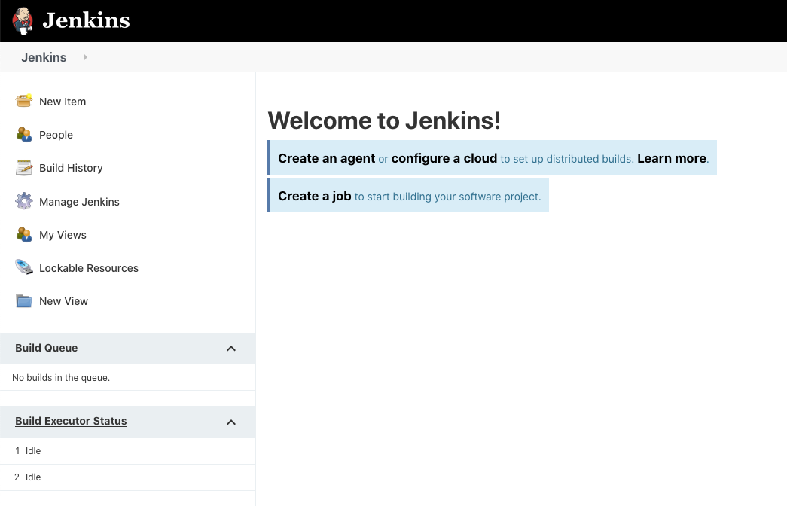
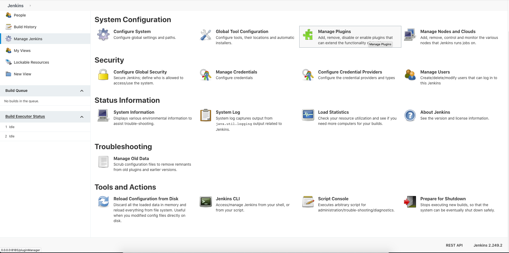
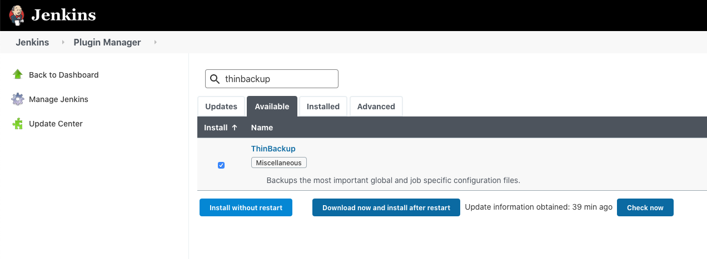
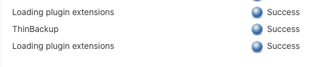

## How to Install ThinBackup Jenkins Plugins

### Prequests
* Jenkins running on healthy.
* Authorize with jenkins admin role for installation.
* **DO NOT Restart** the Jenkins services for this (ThinBackup) plugin installation.

### Step Installations
1. Go to `Manage Jenkins` Menu.
    
1. Select `Manage Plugins` Menu.
    
1. Search `thinbackup` in available tabs search.
    
1. Klik `Install without Restart` button.
1. Wait until `ThinBackup` successfully installed.
    
1. Plugin Installed.
    
1. **-- DONE --**
