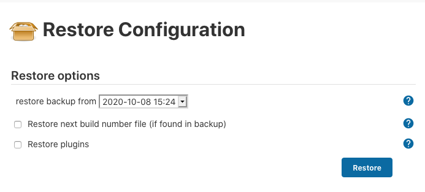
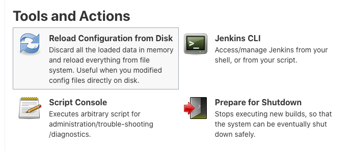
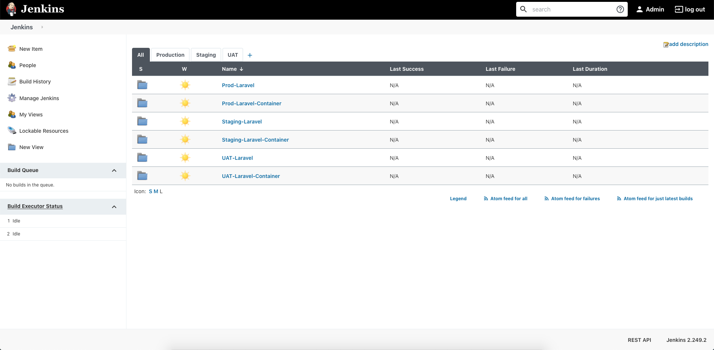

## How to Restore Point ThinBackup

### Step Actions
1. From `Uncategorized` Plugin, select `ThinBackup`.
    
1. Go to `Restore` Menu.
    
1. Select your restore point.
    
1. Checked the options if:
   - Restore next build number file (last number references builder) inside backup file.
   - Restore all plugins from backup files.
1. Click `Restore` button, to execute the restore point.
1. Reload configuration restore point (from disk).
    
1. You will see all jobs restored. Example will be looks like this below:
    
1. **-- DONE --**
