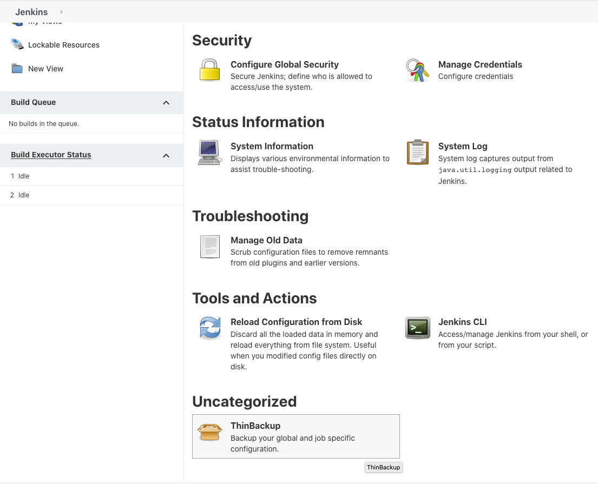
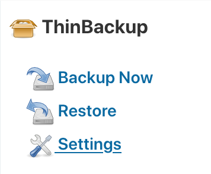
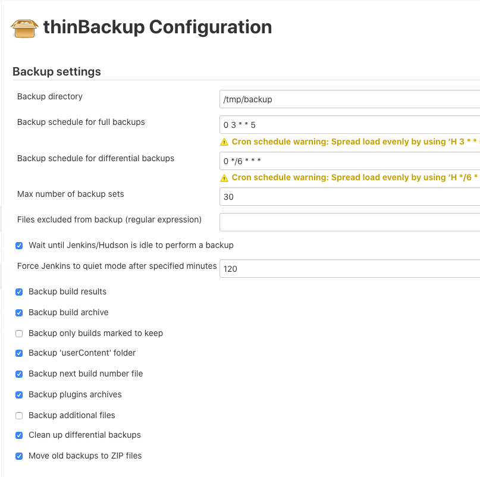
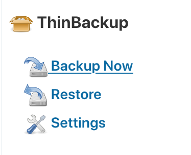

## How to Setup ThinBackup

### Configuration's Setup
1. From `Uncategorized` Plugin, select `ThinBackup`.
   <br>
1. Go to `Setting` Menu.
   <br>
1. Configure the ThinBackup as picture shown below.
   <br>
   ```
   (default)
   -----
   - Backup directory:                /tmp/backup
   - Backup schedule for full backup: 0 3 * * 5     # Every friday at 03.00 PM (server time)
   - Backup schedule for diff vackup: 0 */6 * * *   # Every 6 hours every day (increment backup)
   - Max number of backup sets:       10            # Logrotation files
   ```
1. Save your configuration.
1. Run First Full Backup, clik `Backup Now`.
   <br>
1. **-- DONE --**
